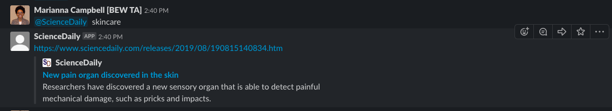

# ScienceDaily
 

A slack bot written in [Go](https://golang.org/) as well as using technologies such as [Colly](http://go-colly.org/) and the [Slack API](https://api.slack.com/).

### Problem
It can be very time comsuming to find truthy articles on skin care. So the @sciencedaily bot when given the keyward skincare will give you a truthy article on just that.

### Goals
My goal is to make getting truthy articles on skin care easier for everyone.

### Audience 

>DISCLAIMER: The sciencedaily bot only works in the Make School Students Slack Workspace

This sciencedaily slack bot is for anyone in the Make School Students Slack Workspace who is slightly interested in skin care and wanting to learn more.

### Installation
> GOOD NEWS for Make School Students no installation required!!!

Invite `@ScienceDaily` to any channel you want to use it in, because the Science Daily Bot lives in the Make School Student Workspace.

### [Live Version](https://makeschoolstudents.slack.com/apps/ARFPV2G4C-sciencedaily?next_id=0)

### Credits
- https://github.com/droxey/goslackit 